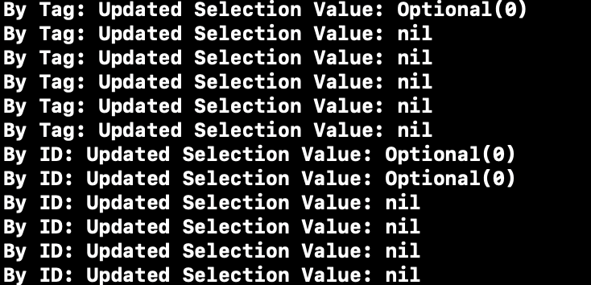

# Broken List Selection Binding in SwiftUI

At the moment, the List selection binding is broken. When using both tags or an Identifiable object, the binding will only ever fire the first row's identifier (even when selecting other rows) and only a few times before only ever firing nil thereafter. 

This example project is best viewed on iPad with the split view completely expanded. When rows are selected, the value of the selection will be printed to console. When run and selecting the rows, something like this is the response: 

