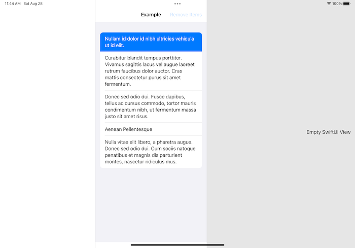
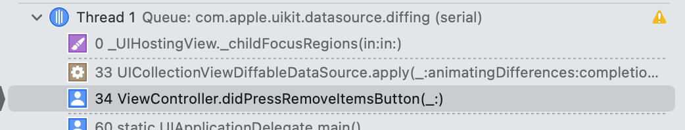
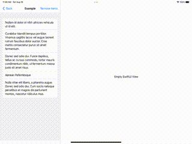

# UIHostingController/Focus system crash 

A reliable crash can be created with SwiftUI, UIHostingController, and the focus system. This crash began in iOS 15 beta 1 and exists in the current most release (beta 7).

### Project Setup

I think that this behavior can be replicated a few other ways, but here is the scenario in this project:

- A UICollectionView inside of a UIViewController in the supplementary column of a UISplitViewController
- Diffable Data Source seeds the list and it contains at least one focusable list item.
- A toggle which emptys the list
- Place a UIHostingController with any view content in the Secondary Column of the same UISplitViewController

### How to replicate using sample project.

To cause the crash:

1. Launch the application on iPad in Landscape

2. Ensure all three columns of the Split View Controller are visible on screen

3. Select any item in the supplementary coumn's list so it is focused

4. Tap the "Remove Items" button 

5. The application crashes:

    

   

 ### Example

